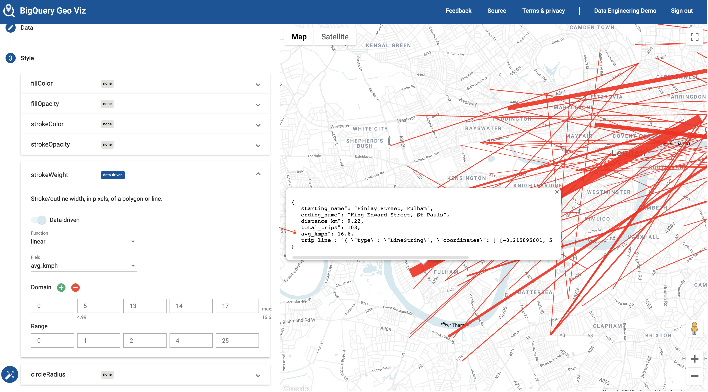
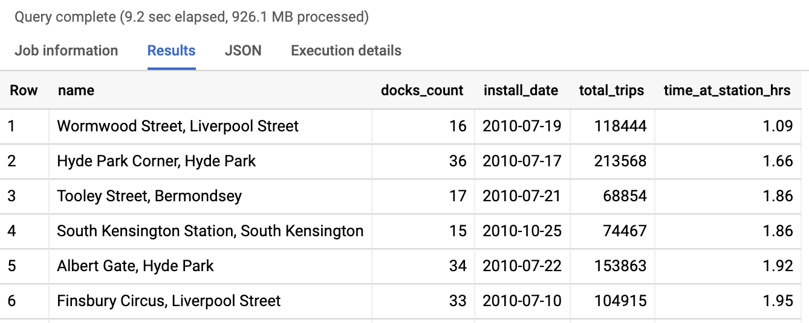
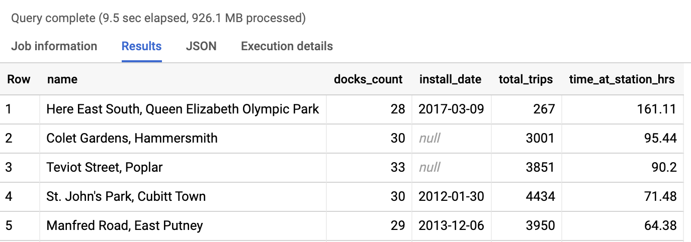

# Advanced BigQuery Functions and GIS

The below example uses data from the [BigQuery Public Dataset on London Bike Share](https://cloud.google.com/bigquery/public-data/) which contains millions of bike trips for analysis.

## Finding the fastest bike commuters in London
The London Bike Share dataset has two tables:
- `cycle_stations` - the basic information about where you can rent bikes (has lat/long)
- `cycle_hire` - transactional inforamation on rentals (duration, starting location, ending location etc.)

Our goal is to create a map showing the station start and ending pair which has the highest average speed for rides over 30 minutes. 

```sql
WITH staging AS (
  SELECT 
    STRUCT(
      start_stn.name,
      ST_GEOGPOINT(start_stn.longitude, start_stn.latitude) AS point,
      start_stn.docks_count,
      start_stn.install_date
    ) AS starting,
    STRUCT(
      end_stn.name,
      ST_GEOGPOINT(end_stn.longitude, end_stn.latitude) AS point,
      end_stn.docks_count,
      end_stn.install_date
    ) AS ending,
    STRUCT(
      rental_id,
      bike_id,
      duration, -- seconds
      ST_DISTANCE(
        ST_GEOGPOINT(start_stn.longitude, start_stn.latitude),
        ST_GEOGPOINT(end_stn.longitude, end_stn.latitude)
        ) AS distance, -- meters
      ST_MAKELINE(
        ST_GEOGPOINT(start_stn.longitude, start_stn.latitude),
        ST_GEOGPOINT(end_stn.longitude, end_stn.latitude)
        ) AS trip_line, -- straight line (for GeoViz)
      start_date,
      end_date
    ) AS bike
  FROM `bigquery-public-data.london_bicycles.cycle_stations` AS start_stn
  LEFT JOIN `bigquery-public-data.london_bicycles.cycle_hire` AS b
  ON start_stn.id = b.start_station_id
  LEFT JOIN `bigquery-public-data.london_bicycles.cycle_stations` AS end_stn
  ON end_stn.id = b.end_station_id
)
-- Find the fastest avg biking pace for rides over 30 mins
SELECT 
  starting.name AS starting_name,
  ending.name AS ending_name,
  ROUND(bike.distance/1000,2) distance_km,
  ST_UNION_AGG(bike.trip_line) AS trip_line,
  COUNT(bike.rental_id) AS total_trips,
  ROUND(
      AVG(
        (bike.distance / 1000) -- meters --> km
        / (bike.duration / 60 / 60) -- seconds --> hours
      )
    ,2)
  AS avg_kmph
FROM staging
WHERE bike.duration > (30 * 60) -- at least 30 minutes = 1800 seconds
GROUP BY 
  starting.name,
  ending.name,
  bike.distance
HAVING total_trips > 100
ORDER BY avg_kmph DESC
LIMIT 100;
```

__Notes to interpret the query:__
- What's with the large `WITH` clause? Wouldn't it be better to store that as a table? Possibly but if you are filtering later on in your query (like Duration > 30), BigQuery can magically push those filters into the `WITH` clause with [automatic predicate pushdown](https://cloud.google.com/bigquery/docs/reference/standard-sql/migrating-from-legacy-sql#advantages_of_standard_sql). If you processed that data already into a table and your users are only using a small fraction of it you may be better of with using WITH clauses. 
- What are the ST_XXXXX functions? "ST" functions are __spatial type__ functions which are commonly used in [GIS](https://en.wikipedia.org/wiki/Geographic_information_system) applications like map calculations. BigQuery natively supports many [GIS functions](https://cloud.google.com/bigquery/docs/reference/standard-sql/geography_functions) like `ST_GEOGPOINT` which converts a lat/long input into a mappable point and `ST_DISTANCE` that calculates the straight-line distance in meters between two map points. 
- What are `STRUCT()` functions? STRUCTs are containers for other fields -- think of them like pre-joined tables in a single table. STRUCTs themselves have names and their field values have names so a STRUCT field like `bike.duration` reads just like a table alias. STRUCTs are commonly used for readability in very wide and denormalized schemas like the [Google Analytics schema](https://support.google.com/analytics/answer/3437719?hl=en). 

## Query results
Below are the fastest (on average) bike station pairs


## Mapping the GIS values with BigQuery GeoViz
You can quickly connect your BigQuery project to [BigQuery GeoViz](https://bigquerygeoviz.appspot.com/) and use a UI to build a map based on your geographic columns. Here we mapped the straight line path of the fastest bike commutes with the thicker lines being the faster riders. 




## Analyzing Bike Turnover: Working with Window functions

For our next problem, we want to see how long bikes are idle at each station on averge before they are picked up by another rider. This could help avoid stock-outs for high-demand stations if we setup a program to incentivize bike rentals from slower turnover stations to highly demanded ones. 

__Questions__
- Which 10 stations turn over bikes the quickest (lowest time at station)?
- Which 10 stations are the slowest at turning over bikes?

```sql
WITH staging AS (
  SELECT 
    STRUCT(
      start_stn.name,
      ST_GEOGPOINT(start_stn.longitude, start_stn.latitude) AS point,
      start_stn.docks_count,
      start_stn.install_date
    ) AS starting,
    STRUCT(
      end_stn.name,
      ST_GEOGPOINT(end_stn.longitude, end_stn.latitude) AS point,
      end_stn.docks_count,
      end_stn.install_date
    ) AS ending,
    STRUCT(
      rental_id,
      bike_id,
      duration, -- seconds
      ST_DISTANCE(
        ST_GEOGPOINT(start_stn.longitude, start_stn.latitude),
        ST_GEOGPOINT(end_stn.longitude, end_stn.latitude)
        ) AS distance, -- meters
      ST_MAKELINE(
        ST_GEOGPOINT(start_stn.longitude, start_stn.latitude),
        ST_GEOGPOINT(end_stn.longitude, end_stn.latitude)
        ) AS trip_line, -- straight line (for GeoViz)
      start_date,
      end_date
    ) AS bike
  FROM `bigquery-public-data.london_bicycles.cycle_stations` AS start_stn
  LEFT JOIN `bigquery-public-data.london_bicycles.cycle_hire` AS b
  ON start_stn.id = b.start_station_id
  LEFT JOIN `bigquery-public-data.london_bicycles.cycle_stations` AS end_stn
  ON end_stn.id = b.end_station_id
),
lag_end_date AS (
-- Find how long after one ride ends, another one begins (on average)
SELECT
  starting.name,
  starting.docks_count,
  starting.install_date,
  bike.bike_id,
  LAG(bike.end_date) OVER (
    PARTITION BY bike.bike_id 
    ORDER BY bike.start_date)
  AS last_end_date,
  bike.start_date,
  bike.end_date
FROM staging
)

SELECT
  name,
  docks_count,
  install_date,
  COUNT(bike_id) AS total_trips,
  ROUND(
    AVG(
      TIMESTAMP_DIFF(start_date, last_end_date, HOUR)
      )
  ,2) AS time_at_station_hrs
FROM lag_end_date
GROUP BY 
  name,
  docks_count,
  install_date
HAVING total_trips > 0
ORDER BY time_at_station_hrs ASC -- fastest turnover first
LIMIT 10;
```

__Notes to interpret the query:__
- The tricky part of this query is getting the last bike's return time and then calculating the time until the next rental for that `bike_id`. If you're focused on the previous of something or the next something you want to use SQL `LAG` or `LEAD` [functions](https://cloud.google.com/bigquery/docs/reference/standard-sql/navigation_functions). 
- Here we want the previous rental return date __for a given bike__ which should alert you that you need to break apart your data into separate windows for analysis. It would do us no good to get the last return time for any bike at any time. That is why we want the `LAG(end_date)` over a window of all the same `bike_id` ensuring that the return dates are in order from oldest to newest. That is what the `PARTITION BY` analytical window function does in the code above. 
- Note: You could absolutely combine the `lag_end_date` common table expression into the final query by doing the `TIMESTAMP_DIFF` and the analytical window function in one go. I broke them out here for readability. 

## Query Results: Stations with the best turnover 


## Query Results: Stations with the slowest turnover
Simply change the `ORDER BY` to `DESC` and now you get the highest idle time for bikes at these stations:



